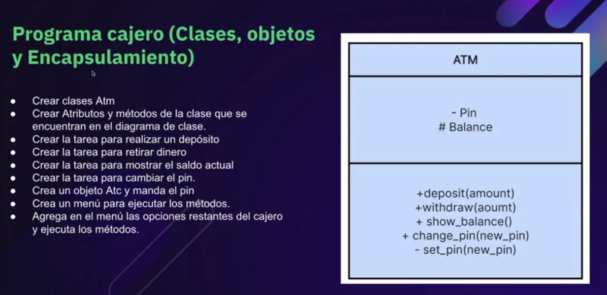

# Cajero_ATM

Programa simple de Python ejecutado en consola que simula operaciones básicas de un cajero automático.

Este proyecto fue realizado como ejercicio práctico para recordar principios de Programación Orientada a Objetos, como clases, objetos, métodos, atributos, encapsulamiento y uso de constructores.

## Diagrama del cajero ATM

  

